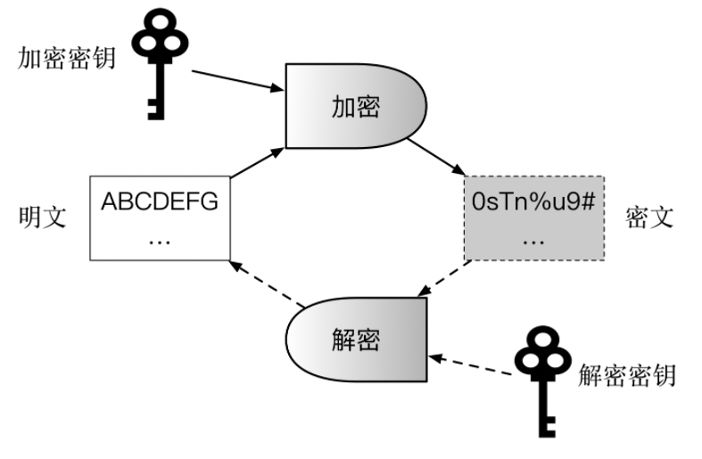

# 简述
本章介绍与区块链密切相关的安全知识，包括Hash算法与摘要、加密算法、数字签名和证书、PKI体系、Merkle树、布隆过滤器、同态加密等。以及如何实现信息安全的核心要素：机密性、完整性、可认证性和不可抵赖性。

# 密码学简史
1945 年 9 月 1 日，Claude Elwood Shannon（克劳德·艾尔伍德·香农）完成了划时代的内部报告《A Mathematical Theory of Cryptography（密码术的一个数学理论）》，1949 年 10 月，该报告以《Communication Theory of Secrecy Systems（保密系统的通信理论）》为题在 Bell System Technical Journal（贝尔系统技术期刊）上正式发表。这篇论文首次将密码学和信息论联系到一起，为对称密码技术提供了数学基础。这也标志着近现代密码学的正式建立

---
# Hash算法与数字摘要
## 定义
Hash（哈希或散列）算法，又常被称为指纹（Fingerprint）或摘要（Digest）算法，可以将任意长度的二进制明文串映射为较短的（通常是固定长度的）二进制串（Hash值），并且不同的明文很难映射为相同的hash值。

例如计算”“Hello World， this is block chain guide”的SHA-256 Hash值
```bash
echo "Hello World， this is block chain guide" | shasum -a 256

1af429b3446508b63400ce6a9cface6bfd3f8566fe014f5f590d540f910a81a9
```

因此对于某个文件，无需查看其内容，只要其SHA-256 Hash计算后结果与上面的结果一致，则该文件内容大概率就是上面的字符串了。
除了快速对比内容外，Hash思想也被用到基于内容的编址或命名算法中。
一个优秀的hash算法，将能满足：
- 正向快速：给定原文和Hash算法，在有限时间和有限资源内能计算得到Hash值。
- 逆向困难：给定（若干）Hash值，在有限时间内无法（基本不可能）逆推出原文；
- 输入敏感：原始输入信息发生任何改变，新产生的Hash值都应该发生很大的变化；
- 碰撞避免：很难找到两段内容不同的铭文，使得它们的Hash值一致（即发生碰撞）。

碰撞避免有时候又被称为“抗碰撞性”，可分为“弱抗碰撞性”和“强抗碰撞性”。给定原文前提下，无法找到与之碰撞的其它原文，则算法具有“弱抗碰撞性”；更一般地，如果无法找到任意两个可碰撞的原文，则称算法具有“强抗碰撞性”。

## 常见算法
Message Digest（MD）系列和Secure Hash Algorithm（SHA）系列算法，以及国内的SM3算法。
## 性能
有计算敏感型和非敏感型。
## 数字摘要
数字摘要是hash算法的重要用途之一。
定义：对原始数字内容进行hash运算，获取唯一的摘要值。
利用hash函数抗碰撞性特点，数字摘要可以检测内容是否被篡改过。
## Hash攻击与防护
Hash算法并不是一种加密算法，不能用于对信息的保护。

但hash算法可用于对登陆口令的保存上。对密码进行hash计算后保存到数据库中。
为了更进一步的加强，可以采用加盐Salt的方法。保存的不是原文的直接hash，而是原文再加上一段随机字符串（即“盐”）之后的hash值。Hash结果和“盐”分别存放在不同的地方。

---
# 加解密算法
从设计理念和应用场景上可以分为两大基本类型：对成加密、非对称加密。

|算法类型|特点|优势|缺陷|代表算法|
|:-|:-|:-|:-|:-|
|对称加密|加解密的秘钥相同|计算效率高，加密强度高|需提前共享秘钥，易泄露|DES、3DES、AES、IDEA|
|非对称加密|加解密的秘钥不相同|无需提前共享秘钥|计算效率低，存在中间人攻击可能|RAS、EIGamal、椭圆曲线算法|

# 加解密系统基本组成

现代加解密系统的典型组件包括算法和秘钥，秘钥包括加密秘钥和解密秘钥。
加解密算法自身是固定不变的，并且一般公开可见；秘钥则是最关键的信息，需要安全地保存起来，甚至通过特殊硬件进行保护。一般来说，秘钥需要在加密前按照特定算法随机生成，长度越大，则加密强度越大。
示意图：


## 对称加密算法
加密和解密的秘钥是相同的。
优点：加解密效率（速度快，空间占用小）和加密强度都很高。
缺点：参与方需提前持有秘钥，一旦有人泄露则系统安全性被破坏；另外如何在不安全通道中提前分发秘钥也是个问题，需要借助额外的Diffie-Hellman协商协议或非对称加密算法来实现。

对称密码从实现原理上可以分为两种：分组加密和序列加密。前者将明文切分为定长数据块作为基本加密单位，应用最为广泛。后者则每次只对一个字节或字符进行加密处理，且密码不断变化，只用在一些特定领域（如数字媒介的加密）。
**分组加密**的代表算法包括DES、3DES、AES、IDEA等
**序列加密**又称流加密。
> 总结： 对称加密算法适用于大量数据的加解密过程，不能用于签名场景，并且需要提前安全地分发秘钥。

## 非对称加密算法
加密秘钥：公钥-->可以根据私钥生成；公开，他人可获取
解密秘钥：私钥--> 随机数算法生成；保密，
适用于：签名场景或秘钥协商过程，但不适合大量数据的加解密。

## 混合加密机制
该机制同时结合了对称加密和非对称加密的有点。
主要过程为：先用非对称加密（计算复杂度较高）协商出一个临时的对称加密秘钥（或称会话秘钥），然后双方再通过对称加密算法（计算复杂度低）对所传递的大量数据进行快速的加密处理。
典型案例：HTTPS；与以明文方式传输数据的HTTP协议不同，HTTPS在传统的HTTP层和TCP层之间引入了Transport Layer Security/Secure Socket Layer（TLS/SSL）加密层来实现安全传输。

---
# 消息认证码与数字签名
消息认证码和数字签名技术通过对消息的摘要进行加密，可以防止消息被篡改和认证身份。

## 消息认证码
消息认证码（Hash-based Message Authentication Code， HMAC），利用对称加密，对消息完整性（integrity）进行保护。
基本过程为对某个消息，利用提前共享的对称秘钥和hash算法进行处理，得到HMAC值。该HMAC值持有方可以向对方证明自己拥有某个对称秘钥，并且确保所传输消息内容未被篡改。
## 数字签名
类似在纸质合同上进行签名以确认合同内容和证明身份。数字签名既可以证实某数字内容的完整性，又可以确认其来源（即不可抵赖，Non-Repudiation）。

一个典型的场景是，Alice 通过信道发给 Bob 一个文件（一份信息），Bob 如何获知所收到的文件即为 Alice 发出的原始版本？Alice 可以先对文件内容进行摘要，然后用自己的私钥对摘要进行加密（签名），之后同时将文件和签名都发给 Bob。Bob 收到文件和签名后，用 Alice 的公钥来解密签名，得到数字摘要，与对文件进行摘要后的结果进行比对。如果一致，说明该文件确实是 Alice 发过来的（因为别人无法拥有 Alice 的私钥），并且文件内容没有被修改过（摘要结果一致）。

除普通的数字签名应用场景外，针对一些特定的安全需求，有一些特殊数字签名技术，包括盲签名、多重签名、群签名、环签名等。
参考：[消息认证码与数字签名 - 区块链技术指南 (gitbook.io)](https://yeasy.gitbook.io/blockchain_guide/05_crypto/signature)

---
# 数字证书
根据所保护公钥的用途，数字证书可以分为加密数字证书（Encryption Certificate）和签名验证数字证书（Signature Certificate）。前者往往用于保护加密用途的公钥；后者则保护用于签名用途的公钥。两种类型的公钥也可以同时放在同一证书中。
一般情况下，证书需要由证书认证机构（Certification Authority， CA）来进行签发和背书。权威的商业证书认证机构包括DigiCert、GlobalSign、VeriSign等。用户也可搭建本地CA系统，供私网使用。

## X.509证书规范
一般的，一个数字证书内容可能包括证书域（证书的版本、序列号、签名算法类型、签发者信息、有效期、被签发主体、签发的公开秘钥）、CA对证书的签名算法和签名值。
目前使用最广泛的标准为 ITU 和 ISO 联合制定的 X.509 的 v3 版本规范（RFC 5280）。
## 证书格式
X.509规范中一般推荐使用PEM（Privacy Enhanced Mail）格式来存储证书相关的文件。证书文件的文件名后缀一般为`.crt`或`.cer`，对应私钥文件的文件名后缀一般为`.key`，证书请求文件的文件后缀为`.csr`。有时候也统一用`.pem`作为文件名后缀。
PEM 格式采用文本方式进行存储，一般包括首尾标记和内容块，内容块采用 base64 编码。

可以通过openssl工具来查看其内容。
```bash
openssl x509 -in example.com-cert.pem -noout -text
```

## 证书信任链
证书中记录了大量的信息，其中最重要的包括`签发的公开秘钥`和`CA数字签名`。因此，只要使用CA的公钥再对这个证书进行签名对比，就能证明所记录的公钥是否合法。

---
# 其他技术
## 零知识证明
零知识证明（Zero Knowledge Proof），是这样一个过程，证明者在不向验证者提供任何额外信息的前提下，使验证者相信某个论断（statement）是正确的。
证明过程包括交互式（Interactive）和非交互（Non-interactive）式两种。

---

# 共识机制
比特币网络是完全公开的，任何人都可以匿名接入，因此共识协议的稳定性和防攻击性十分关键。
比特币区块链采用了Proof of Work（PoW）机制来实现共识。
目前， Proof of X系列中比较出名的一致性协议包括PoW，PoS和DPoS等，都是通过经济惩罚来限制恶意参与。

## 工作量证明
工作量证明是通过计算来猜测一个数值（nonce），使得拼凑上交易数据后内容的hash值满足规定的上限。由于hash难题在目前计算模型下需要大量的计算，这就保证在一段时间内，系统中只能出现少数合法提案。反过来，如果谁能够提出合法提案，也证明提案者确实已经付出了一定的工作量。
Hash问题具有不可逆的特点，因此，目前除了暴力计算外，还没有有效的算法进行解决。反之，如果获得符合要求的nonce，则说明在概率上是付出了对应的算例。谁的算力多，谁先解决问题的概率就大。当掌握超过全网一般算力时，从概率上就能空值网络中链的走向。这也是所谓`51%`攻击的由来。

