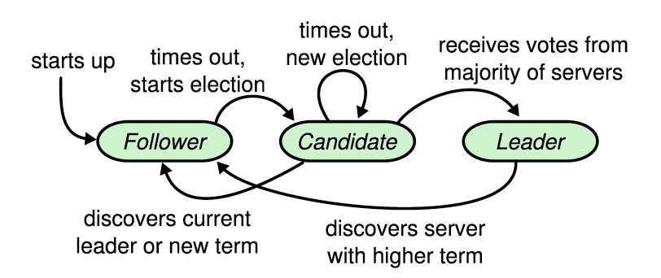

# Raft共识算法

Raft把consensus算法分解为3个独立的子问题：
1. **Leader Selection**：a new leader must be chosen when an existing leader fails
2. **Log Replication**: the leader must accept log entries from clients 并且给其他节点复制，并保证其他节点同意。
3. **Safety**: State Machine Safety

# 基础内容
## raft集群节点个数
一般为5个，此时可以容忍2个失效。

## 节点的状态
`leader`, `follower`, `candidate`，一般来说，只有一个leader，其余都是follower。
follower是被动的：只对leader或者candidate做出响应。
leader接受所有客户端的请求（if a client contacts a follower, the follower redirects it to the leader）。
candidate用来选举新的leader。

## 任期term
raft任期的长度是不固定的。任期用连续的数来标识。以选举来开始一个任期，所有的候选节点争做leader，若candidate赢得选举，之后在该任期之内则变为leader。当出现平票的情况：则该轮选举无leader，则会开始新的一轮选举。

