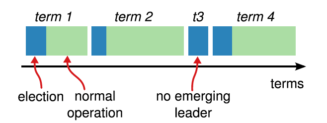

# Raft共识算法

Raft把consensus算法分解为3个独立的子问题：
1. **Leader Selection**：a new leader must be chosen when an existing leader fails
2. **Log Replication**: the leader must accept log entries from clients 并且给其他节点复制，并保证其他节点同意。
3. **Safety**: State Machine Safety

# 基础内容
## raft集群节点个数
一般为5个，此时可以容忍2个失效。

## 节点的状态
`leader`, `follower`, `candidate`，一般来说，只有一个leader，其余都是follower。
follower是被动的：只对leader或者candidate做出响应。
leader接受所有客户端的请求（if a client contacts a follower, the follower redirects it to the leader）。
candidate用来选举新的leader。

## 任期term
raft任期的长度是不固定的。任期用连续的数来标识。以选举来开始一个任期，所有的候选节点争做leader，若candidate赢得选举，之后在该任期之内则变为leader。当出现平票的情况：则该轮选举无leader，则会开始新的一轮选举。

## 5个属性
Election Safety：一个任期内，最多能选举出一个leader。
Leader Append Only：leader不会删除或复写log entries；只增加新的entries
Log Matching: if two logs contain an entry with the same index and term, then the logs are identical in all entries up through the given index.
Leader Completeness: 在指定任期内提交了一个log entry，则之后所有的任期，都会存在该log记录
State Machine Safety：若一个节点在指定的index上applied一个log entry，则其他节点不会出现同样的index的不同的log。

# state
## 持久状态【所有节点】
在响应rpc请求前完成存储
- currentTerm：当前任期（单调递增，从0开始）
- votedFor：投票对象id（可为null）
- log[]: log实体，其中包含
	- 给state machine的命令
	- 提交log entry时的任期term
## 可变状态【所有节点】
- commitIndex：最后一个被提交的log entry的index。
- lastApplied：最后一个被接受的log entry的index。
## leader节点可变状态
每次选举之后会重新初始化。
nextIndex[]: 对于每一个节点来说，是下个log entry的index
matchIndex[]：将要被复制的log entry的最新的index。

# AppendEntries RPC
由leader节点调用，用来复制log entry（replicate log entries），也可用来进行心跳检测。
### 参数：
- term
- leaderId
- prevLogIndex
- prevLogTerm
- entries[]：当用作心跳检测时，可为空。
- leaderCommit：leader‘s commitIndex

### 结果：
- term
- success：true if follower contained entry matching prevLogIndex and prevLogTerm

### 接收者实现（receiver implementation）
1.  Reply false if term < currentTerm
2.  Reply false if log doesn’t contain an entry at prevLogIndex whose term matches prevLogTerm
3.  如果已存在的log entry与新的entry的term不同但index相同，需要删除这个已存在的entry及它之后所有的entry。If an existing entry conflicts with a new one (same index but different terms), delete the existing entry and all that follow it
4.  Append any new entries not already in the log
5.  If leaderCommit > commitIndex, set commitIndex = min(leaderCommit, index of last new entry)

# Rules for Servers【角色】
### All Servers：
-   如果commitIndex大于lastApplied，递增lastApplied，apply log[lastApplied] to 状态机。
-   如果RPC请求或相应包含的term T大于currentTerm，set currentTerm = T, 变成follower

### Followers：
-   响应来自candidates和leaders的rpc请求
-   如果选举超时，且没有收到当前leader的AppendEntries的RPC请求或者执行给candidates投票的动作：变成candidate。

### Candidates：
-   在转换成candidate时，开始选举：
    -   currentTerm+1
    -   Vote for self
    -   重置选举计时器（election timer）
    -   发送投票RPC请求，让其他节点给自己投票
-   接收到大多数节点的投票：变成leader
-   收到了新leader的AppendEntries RPC：变成follower
-   选举若超时，则开始新的一轮选举

### Leaders:
-   选举：周期性的给其他节点发送空的AppendEntries RPC（心跳检测），以防止选举超时；
-   接收到客户端的命令：先把entry放置到local log中，entry保存到状态机之后才给响应。
-   follower的最后一条的log的index ≥ nextIndex：发送AppendEntries RPC with log entries starting at nextIndex
    -   若成功：update nextIndex and matchIndex for follower
    -   失败：decrement nextIndex and retry
-   有一个N，且N>commitIndex. 大多数matchIndex[i] ≥ N,and log[N].term == currentTerm: set commitIndex = N

## RequestVote RPC

由candidates唤醒，请求开始投票

### 参数
-   term candidate’s term
-   candidateId：candidate requesting vote
-   lastLogIndex： index of candidate’s last log entry
-   lastLogTerm： term of candidate’s last log entry

### Results：
term: currentTerm, for candidate to update itself voteGranted: true means candidate received vote

### Receiver implementation:
1.  Reply false if term < currentTerm
2.  If votedFor is null or candidateId, and candidate’s log is at least as up-to-date as receiver’s log, grant vote【授予投票权】