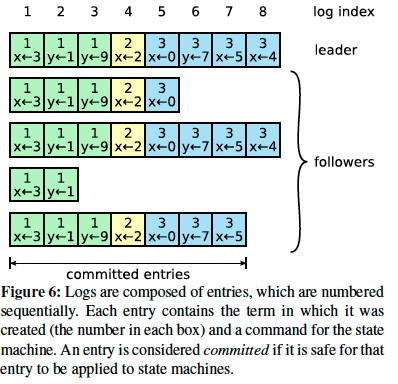

# Raft共识算法

Raft把consensus算法分解为3个独立的子问题：
1. **Leader Selection**：a new leader must be chosen when an existing leader fails
2. **Log Replication**: the leader must accept log entries from clients 并且给其他节点复制，并保证其他节点同意。
3. **Safety**: State Machine Safety

# 1. 前置内容

## 1.1 raft集群节点个数

一般为5个，此时可以容忍2个失效。

## 1.2节点的状态

`leader`, `follower`, `candidate`，一般来说，只有一个leader，其余都是follower。

图4：各节点的状态。

`Followers`：只响应来自其他节点的请求【只对leader和candidate做出响应】，如果没有收到其他节点的信息，则会变成candidate并且初始化一个**选举过程**。若该节点收到了客户端的请求，则会重定向至leader节点。
`Candidate`：用来选举新的leader。如果收到大多数节点的投票，则会变成Leader。
`Leader`：会一直工作到失败。其接受所有客户的请求，

## 1.3 任期term

图5:任期

## 1.4 简明总结
### 1.4.1 5个属性
Election Safety：一个任期内，最多能选举出一个leader。
Leader Append Only：leader不会删除或复写log entries；只增加新的entries
Log Matching: if two logs contain an entry with the same index and term, then the logs are identical in all entries up through the given index.
Leader Completeness: 在指定任期内提交了一个log entry，则之后所有的任期，都会存在该log记录
State Machine Safety：若一个节点在指定的index上applied一个log entry，则其他节点不会出现同样的index的不同的log。

### 1.4.2 state
#### 持久状态【所有节点】
在响应rpc请求前完成存储
- currentTerm：当前任期（单调递增，从0开始）
- votedFor：投票对象id（可为null）
- log[]: log实体，其中包含
	- 给state machine的命令
	- 提交log entry时的任期term
#### 可变状态【所有节点】
- commitIndex：最后一个被提交的log entry的index。
- lastApplied：最后一个被接受的log entry的index。
#### leader节点可变状态
每次选举之后会重新初始化。
nextIndex[]: 对于每一个节点来说，是下个log entry的index
matchIndex[]：将要被复制的log entry的最新的index。

### 1.4.3 AppendEntries RPC
由leader节点调用，用来复制log entry（replicate log entries），也可用来进行心跳检测。
#### 参数：
- term
- leaderId
- prevLogIndex
- prevLogTerm
- entries[]：当用作心跳检测时，可为空。
- leaderCommit：leader‘s commitIndex

#### 结果：
- term
- success：true if follower contained entry matching prevLogIndex and prevLogTerm

#### 接收者实现（receiver implementation）
1.  Reply false if term < currentTerm
2.  Reply false if log doesn’t contain an entry at prevLogIndex whose term matches prevLogTerm
3.  如果已存在的log entry与新的entry的term不同但index相同，需要删除这个已存在的entry及它之后所有的entry。If an existing entry conflicts with a new one (same index but different terms), delete the existing entry and all that follow it
4.  Append any new entries not already in the log
5.  If leaderCommit > commitIndex, set commitIndex = min(leaderCommit, index of last new entry)

### 1.4.4 Rules for Servers【角色】
#### All Servers：
-   如果commitIndex大于lastApplied，递增lastApplied，apply log[lastApplied] to 状态机。
-   如果RPC请求或相应包含的term T大于currentTerm，set currentTerm = T, 变成follower

#### Followers：
-   响应来自candidates和leaders的rpc请求
-   如果选举超时，且没有收到当前leader的AppendEntries的RPC请求或者执行给candidates投票的动作：变成candidate。

#### Candidates：
-   在转换成candidate时，开始选举：
    -   currentTerm+1
    -   Vote for self
    -   重置选举计时器（election timer）
    -   发送投票RPC请求，让其他节点给自己投票
-   接收到大多数节点的投票：变成leader
-   收到了新leader的AppendEntries RPC：变成follower
-   选举若超时，则开始新的一轮选举

#### Leaders:
-   选举：周期性的给其他节点发送空的AppendEntries RPC（心跳检测），以防止选举超时；
-   接收到客户端的命令：先把entry放置到local log中，entry保存到状态机之后才给响应。
-   follower的最后一条的log的index ≥ nextIndex：发送AppendEntries RPC with log entries starting at nextIndex
    -   若成功：update nextIndex and matchIndex for follower
    -   失败：decrement nextIndex and retry
-   有一个N，且N>commitIndex. 大多数matchIndex[i] ≥ N,and log[N].term == currentTerm: set commitIndex = N

### 1.4.5 RequestVote RPC

由candidates唤醒，请求开始投票

#### 参数
-   term candidate’s term
-   candidateId：candidate requesting vote
-   lastLogIndex： index of candidate’s last log entry
-   lastLogTerm： term of candidate’s last log entry

#### Results：
term: currentTerm, for candidate to update itself voteGranted: true means candidate received vote

#### Receiver implementation:
1.  Reply false if term < currentTerm
2.  If votedFor is null or candidateId, and candidate’s log is at least as up-to-date as receiver’s log, grant vote【授予投票权】

# 2 正题
# 2.1 Raft 基础

raft任期的长度是不固定的。任期用连续的数来标识。以选举来开始一个任期，所有的候选节点争做leader，若candidate赢得选举，之后在该任期之内则变为leader。当出现平票的情况：则该轮选举无leader，则会开始新的一轮选举。
不同的节点察觉到任期的变化的时间可能是不同的，甚至整个选举的过程及任期都没有察觉到。在Raft中Terms扮演着一个逻辑时钟的角色，并且terms允许节点去检测过时的一些信息，比如以前的leaders。每个节点都存储一个*当前任期 current term号*，其任期号随着时间单调递增。当前任期数会随着节点间的通讯随时交换；

if one server’s current term is smaller than the other’s, then it updates its current term to the larger value.
若某个节点存的当前任期号小于其他节点，则会主动更新为大的任期号。      

If a candidate or leader discovers that its term is out of date, it immediately reverts to follower state.
若任期号超时，则该节点会立刻变成follower。

If a server receives a request with a stale term number, it rejects the request.
拒绝携带有旧的任期号的请求。

Raft servers communicate using remote procedure calls (RPCs), and the consensus algorithm requires only two types of RPCs. RequestVote RPCs are initiated by candidates during elections (Section 5.2), and AppendEntries RPCs are initiated by leaders to replicate log entries and to provide a form of heartbeat (Section 5.3). Servers retry RPCs if they do not receive a response in a timely manner, and they issue RPCs in parallel for best performance.
Raft节点间用RPC通信，并且共识算法[consensus algorithm]只需要两种RPC就可：
- RequestVote RPC：由candidate节点发出，用来号召大家开始投票。
- AppendEntries RPC：用leader节点发出，用来复制log和提供心跳检测。
若未收到响应，节点会在迅速重试。
## 2.2 Leader 选举
Raft用心跳机制来出发leader选举。当节点启动时其身份为follower，只要一直可以收到leader或candidate的有效的RPC，则follower的身份保持不变。leader发送心跳【空的AppendEntries】给其他所有的followers来维护自己的权威。
如果一个follower在一定时间内未收到任何信息【叫election timeout】，则它会以为没有leader了，那么自己开始一个选举，来号召大家选举一个新的leader。
若要开始一个新的选举，则follower首先要自增自己的任期号（这个任期号是上一任的留下的），然后把自己变成`candidate`。然后给自己投一票，并同时通过RequestVote RPCs号召他人给自己投票。当如下事情发生时，自己candidate的仕途才会更进一步：
1. 自己赢得了选举
2. 其他人变成了leader
3. 一段时间过去了，谁也没有当上leader。

当大多数人同意时，candidate节点才会变成leader。在投票时，每个节点只有一个投票的机会，谁的RequestVote先来先给谁投票。大多数规则保证了只有一个candidate会赢得某个任期的选举。一旦某个节点赢得了选举，则变为leader。之后就给其他节点发送heartbeat来巩固自己的权威，并阻止的新的选举。

在等待他人给自己投票的同时，candidate节点可能会收到其他节点的AppendEntries RPC来表明发送RPC的节点为leader。若leader的任期号大于等于自己的存储的任期号，则承认这个leader，之后由candidate变为follower。反之，若小于自己的任期号，则会拒绝该RPC，继续保持Candidate的身份。

当谁也没有当上leader的时候：好几个follower都同时变成了candidate，则会发生平票的情况。此时若不加干涉，哪怕重新开始新的一轮选股，则仍有一定概率会发生平票，并且就这样僵持下去。
Raft用了随机的选举过期时间（例如150-300ms）来确保很少的几率发生平票并且就算发生了也会很快被解决。
## 2.3 Log 复制

图6：一个小格子代表一个log entry，格子上面的数字表示任期，下面的表示command。

一旦选举出一个leader，则该leader就要服务于clients了。每个客户的请求都包含一个要被replicated state machines执行的指令。leader把该指令追加到自己的log中最为一个新的entry。然后同时给其他节点发送AppendEntries RPC请求来复制这个entry。当这个entry被其他节点安全的复制了【replicated】，然后leader才会把这个entry保存到自己的state machine中，然后才把结果返回给客户。若follower崩了或者运行缓慢又或者网络运行不稳定，则leader会进行无限制的重试，直到所有节点都完成存储。
log entry包含：state machine command和任期号。log entry中的任期号用来检测log entry间的差异和保证【5个属性】。每一个log entry也有一个整型的索引来表名自己在整个log中的位置。
Leader节点决定何时安全的保存log；保存后的log称为*committed*。Raft确保log的持久性保存和各节点的最终一致性

> 原文这样写：Raft guarantees that committed entries are durable and will eventually be executed by all of the available state machines.。

一条log entry被committed的条件是集群中大多数节点已经复制【replicated】了，例如图6的entry 7。当committed一条log entry的时候，该log entry前的所有未commit的日志都会被committed。2.4节会说明关于leader变化之后commit log的细节情况。leader保存着最新的将要被committed的index，同时还保存着之后的AppendEntries RPC中的index【没有明白啥意思】以便其他节点能够找到该index。一旦follower知道log entry在leader那被committed了，则它会把该log entry保存在自己的本地（local state machine）。

Raft设计这种log机制来维持一种在不同节点的日志间的高度的连续化。不仅简化了系统的动作，而且使系统更加可预测化。
## 2.4 Safety