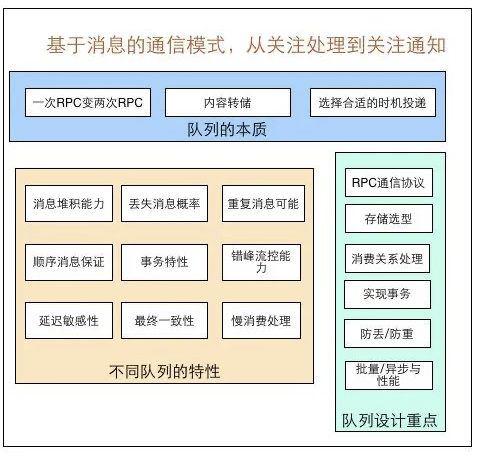

# 一、消息队列的演进
分布式消息队列中间件是大型分布式系统中常见的中间件。消息队列主要用来解决`应用耦合`、`异步消息`、`流量削峰`等问题，具有高性能、高可用、可伸缩和[最终一致性](./什么是最终一致性.md)等特点。消息队列已经逐渐成为企业应用系统内部通信的核心手段，使用较多的消息队列有RabbitMQ、RocketMQ、ActiveMQ、Kafka、ZeroMQ、Pulsar等，此外，利用数据库（如Redis、MySQL等）也可实现消息队列的部分基本功能。

## 1.基于OS的MQ
单机消息队列可以通过操作系统原生的进程间通信机制来实现，如消息队列、共享内存等。比如我们可以在共享内存中维护一个双端队列，消息产出进程不停地往队列里添加消息，同时消息消费进程不断地从队尾取出这些消息。添加消息的任务称为producer，取出消息的称为consumer。
单机MQ易于实现，但是缺点明显：依赖于单机OS的IPC（进程间通信）机制。**无法实现分布式的消息传递**，并且**消息队列的容量也受限于单机资源**。
## 2.基于DB的MQ
使用存储组件（如mysql、redis等）存储消息，然后在消息的生产侧和消费侧实现消息的生产消费逻辑，从而实现MQ功能。以redis为例，可以使用Redis自带的list实现。Redis list使用lpush命令，从队列左边插入数据；使用rpop命令，从队列右边取出数据。
与单机MQ相比，该方案至少满足了分布式，但是仍然带有很多无法接受的缺陷。
- 热key性能问题：不论使用codis还是twemproxy这种集群方案，对某个队列的读写请求最终都会落到同一台redis实例上，并且无法通过扩容来解决问题。如果对于某个list的并发读写非常高，就产生了无法解决的热key，严重可能导致系统崩溃。
- 没有消费确认机制：每当执行rpop消费一条数据，那条消息就被从list中永久删除了。如果消费者消费失败，这条消息也没法找回了。
- 不支持多订阅者：一条消息只能被一个消费者消费。rpop之后就没了。如果队列中存储的是应用的日志，对于同一条消息，监控系统需要消费它来进行可能的报警，BI系统需要消费它来绘制报表，链路追踪需要消费它来绘制调用关系。。。这种场景redis酒办不到了。
- 不支持二次消费：一条消息 rpop 之后就没了。如果消费者程序运行到一半发现代码有 bug，修复之后想从头再消费一次就不行了。

## 3.专用分布式MQ中间件
随着发展，一个真正的消息队列，已经不仅仅是一个队列那么简单了，业务对MQ的吞吐量、扩展性、稳定性、可靠性等都提出了严苛的要求。因此，专用的分布式消息中间件开始大量出现。常见的有 RabbitMQ、RocketMQ、ActiveMQ、Kafka、ZeroMQ、Pulsar 等等。

# 二、消息队列的设计要点
消息队列本质上是一个消息的转发系统，把一次RPC就可以直接完成的消息投递，转换成多次RPC间接完成，这其中包含两个关键环节：
1. 消息转储
2. 消息投递：时机和对象
基于此，消息队列的整体设计思路是：
	- 确定整体的数据流向：如producer发送给MQ，MQ转发给consumer，consumer回复消费确认，消息删除、消息备份等。
	- 利用RPC将数据流串起来，最好基于现有的RPC框架，尽量做到无状态、方便水平扩展。
	- 存储选型，综合考虑性能、可靠性和开发维护成本等诸多因素。
	- 消息投递，消费模式push、pull。
	- 消费关系维护，单播，多播等，可以利用zk、config server等保存消费关系。
	- 高级特性，如可靠投递、重复消息，顺序消息等，很多高级特性之间是互相制约的关系，这里要充分结合应用场景做出取舍。

## 1.MQ基本特性
### RPC通信
MQ组件要实现和生产者以及消费者进行通行功能，这里涉及到RPC通信问题。消息队列的RPC，和普通的RPC没有本质区别。对于负载均衡、服务发现、序列化协议等等问题都可以借助现有RPC框架来实现